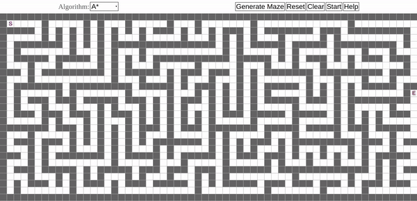

 
# Path Finding Algorithms
***

# Description
* Path finding algorithms implementation using **p5.js**
* Official **p5.js** website: https://p5js.org/
* See the LICENSE file for details.
# Run
* Open `index.html` in your browser.
* **Left** mouse click will add objects.
* **Right** mouse click will remove objects.
* You can select your algorithm from top left corner.
* Click to **help button** to see keyboard shortcuts.
* When you are ready, click to `start` button.
# Contributing
* Fork and clone the repository.
* Make your contribution.
* Push and open a pull request.
* All ideas and helps are welcome. For more, please contact with me.
# Authors
* Mert Türkmenoğlu
